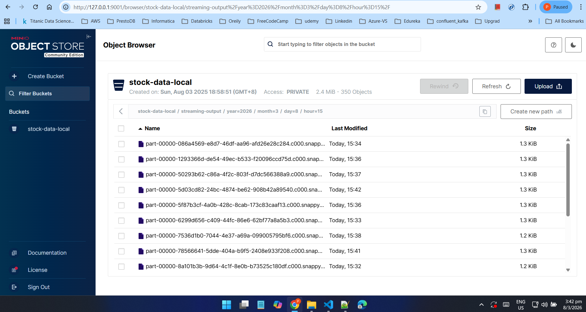
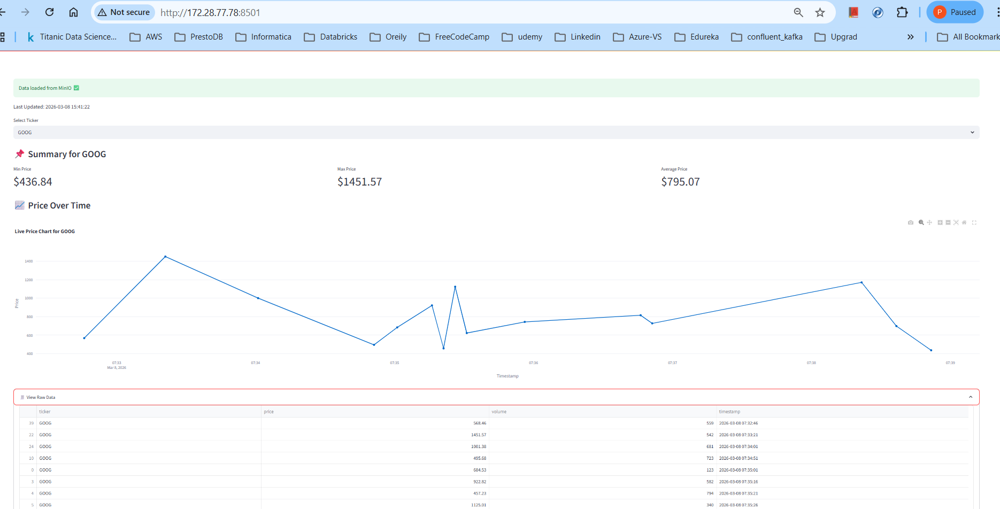

# 📈 Stock Market Streaming Platform

A production-style **real-time stock market streaming and analytics platform** built to demonstrate modern data engineering, streaming systems, and lakehouse design.

This project simulates high-frequency stock ticks, processes them using Spark Structured Streaming, stores them in an S3-compatible lakehouse (MinIO), orchestrates batch compaction via Airflow, models analytics using dbt + DuckDB, and visualizes trends in real time using Streamlit.

> 🧠 Built to showcase **streaming expertise**, **system design**, and **tech leadership mindset**.

---

## 🎯 Goals of This Project

- Demonstrate **end-to-end streaming system design**
- Showcase **production-grade Spark Structured Streaming**
- Implement **lakehouse patterns** (raw → compacted → analytics)
- Orchestrate batch jobs using **Airflow**
- Model analytics using **dbt**
- Visualize real-time insights with **Streamlit**
- Position the author for **Senior Engineer / Tech Lead / CTO** roles

---

## 🏗️ High-Level Architecture

```bash
Kafka (Stock Ticks)
↓
Spark Structured Streaming
↓
MinIO (S3-compatible Object Storage)
↓
Spark Compaction Jobs (Airflow Orchestrated)
↓
dbt + DuckDB (Analytics Layer)
↓
Streamlit Dashboard (Visualization)
```


📄 Deep dives:
- `docs/executive-summary.md`
- `docs/failure-and-recovery.md`

---

## 📂 Project Structure

```text
stock-pipeline/
│
├── data_simulator/        # Kafka producer simulating stock ticks
│
├── spark_processor/       # Spark streaming & compaction jobs
│   ├── stream_processor.py
│   ├── compaction_job.py
│   └── run_compaction.sh
│
├── jars/                  # Explicit Spark / Hadoop / Kafka dependencies
│
├── output/                # Raw streaming parquet output
├── aggregates/            # Aggregated parquet outputs
├── checkpoint/            # Spark streaming checkpoints
│
├── dashboards/            # Streamlit live dashboard
│   └── dashboard_live.py
│
├── airflow/               # Airflow DAGs for orchestration
│   └── dags/
│
├── dbt_models/            # dbt project with DuckDB
│   ├── models/
│   ├── dbt_project.yml
│   ├── profiles.yml
│   └── dev.duckdb
│
├── infra/                 # Docker / MinIO / Infra setup
├── artifacts/             # Screenshots, diagrams, demo assets
├── docs/                  # Architecture & design docs
├── logs/                  # Runtime logs
├── venv/                  # Python virtual environment
│
├── README.md
└── spark-4.0.0-bin-hadoop3.tgz
```
---

## ⚙️ Core Components
### 🚀 Data Ingestion (Kafka)

- Simulated stock tick producer
- Durable event buffering
- Decouples producers and consumers

### 🔥 Stream Processing (Spark)

- Spark Structured Streaming
- Exactly-once semantics (checkpoint-based)
- Time-partitioned Parquet output

### 🪣 Storage (MinIO)

- S3-compatible object storage
- Raw + compacted datasets
- Partitioned by time

### 🧹 Compaction (Spark Batch)

- Solves the small-file problem
- Rewrites partitions efficiently
- Idempotent design
- Orchestrated by Airflow

### ⏱️ Orchestration (Airflow)

- Scheduled compaction jobs
- Partition-aware execution
- Failure retries & observability

### 📊 Analytics (dbt + DuckDB)

- SQL-based transformations
- Fast local analytics over Parquet
- Clean separation from ingestion layer

### 📈 Visualization (Streamlit)

- Live stock trends
- Min / Max / Avg price metrics
- Stateless, restart-friendly UI
  
---

## ▶️ Running the Platform (Local)

Please refer `docs/start-stop-services.md

To start all the services in single click #`sh -x start_all.sh`#
and 
to stop all the services in single click #`sh -x stop_all.sh`#

---

## 🛡️ Failure Handling & Recovery

This platform is intentionally designed to:

- Isolate failures
- Prevent data loss
- Enable predictable recovery

📄 See: docs/failure-and-recovery.md

---

## 🚧 Future Enhancements

- Schema Registry integration
- Delta Lake / Iceberg support
- End-to-end exactly-once guarantees
- Cloud deployment (AWS / AZURE/ GCP)
- CI/CD for Spark, Airflow, and dbt

---

## 👤 Author

### Parag Jain

Director Software Engineering | Streaming & Data Platforms |
Cloud & AIML evangelist| Aspiring CTO | FinTech Systems

**🔗 GitHub:** https://github.com/jainparag1**   
**🔗 LinkedIn:** https://www.linkedin.com/in/parag-jain-0395011**

---

## ⭐ Final Note

This project is intentionally designed to reflect **real-world production tradeoffs** rather than tutorial shortcuts.

If you are a **recruiter, hiring manager, or founder,** this repository demonstrates how I approach building, operating, and scaling modern data platforms.

---

---

## 📸 Platform Screenshots

### MinIO Lakehouse Storage

Raw streaming parquet files stored in S3-compatible object storage.



---

### Live Streamlit Dashboard

Real-time visualization of stock price trends.



---

